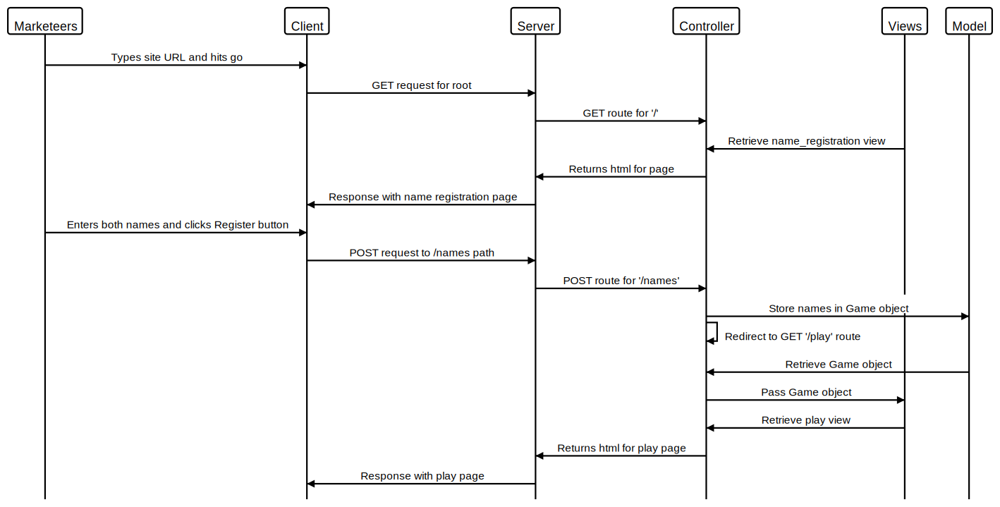
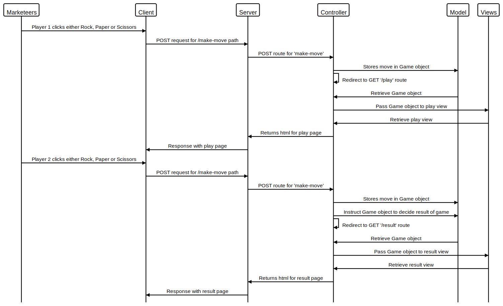

# RPS Challenge

Task
----

The Makers Academy Marketing Array ( **MAMA** ) have asked us to provide a game for them. Their daily grind is pretty tough and they need time to steam a little.

Your task is to provide a _Rock, Paper, Scissors_ game for them so they can play on the web with the following user stories:

```
As a marketeer
So that I can see my name in lights
I would like to register my name before playing an online game

As a marketeer
So that I can enjoy myself away from the daily grind
I would like to be able to play rock/paper/scissors
```

## Bonus level 1: Multiplayer

Change the game so that two marketeers can play against each other ( _yes there are two of them_ ).

## Bonus level 2: Rock, Paper, Scissors, Spock, Lizard

Use the _special_ rules ( _you can find them here http://en.wikipedia.org/wiki/Rock-paper-scissors-lizard-Spock_ )

## Getting started

```
# clone the repository to your local machine with either

# if you're using ssh
git clone git@github.com:PhilipVigus/rps-challenge.git

# if you're using https
git clone https://github.com/PhilipVigus/rps-challenge.git

# Dependencies
# The repository requires bundle, which can be installed with
gem install bundle

# then run bundle from the root project directory to install other dependencies
bundle
```

## Running tests

```
# Runs the full test suite from the root project directory
rspec
```

## Approach

The first thing I did was to rough out a process model for the name registration user story. Although this changed slightly as I implemented the stories, the fundamental structure stayed the same, which I was very pleased about. Doing this so early helped give me a good general idea of how I wanted to put things together, and once I got going with the challenge I felt it unnecessary to rough out any further process models.

Implementing the first bonus level was extremely challenging. and I had to revise many of the existing feature tests and expand the model layer of the application code. I eventually ended up with the following class diagram for the model layer. Note that predicate methods are not showing ? at the end of their names. Also, the create and instance methods of the Game class are class rather than instance methods:


The two most challenging aspects of the implementation were refactoring out the MoveList, and ensuring there were no dependencies between the individual unit tests and classes not being tested. Setting up the doubles and stubs for the Game unit tests was particularly tough, and I spent a lot of time working through how to ensure the tests were meaningful.

I'm still not happy with the extraction of the MoveList class from Game, although it was very necessary given the size the Game class had got to prior to refactoring. I find the separation of make_move and decide_results methods very clunky. I experimented with ways of deciding the result of the game once the second move was passed in rather than calling a method separately, but nothing felt like it made sense semantically. I suspect its a problem with the way I'm naming the methods involved.

## Process models

### Users registering their names before starting a game



### Users playing a multi-player game


